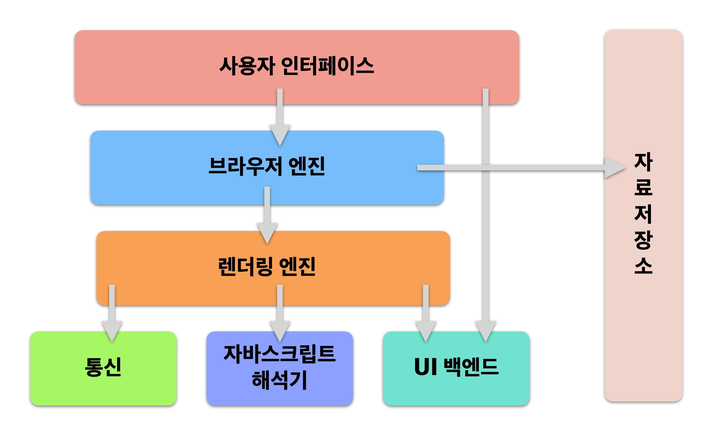

# DOM(document object model)

## 브라우저의 구조

### 사용자 인터페이스

- 이전, 다음, 새로고침 버튼 등 유저가 브라우저에 요청을 할 수 있는 인터페이스

### 브라우저 엔진

- HTML 문서와 기타 지원의 웹페이지를 사용자의 장치에 시각 표현으로 변환 시키며, DOM을 구현한다
- 레이아웃 엔진이라고도 불리며, 렌더링 엔진과 밀접하게 연관이 있어 렌더링 엔진과 브라우저 엔진을 묶어 브라우저 엔진이라고 부르기도 한다
- 웹 브라우저마다 전용 브라우저 엔진을 사용한다(ex 크롬 :Blink)

### 렌더링 엔진

- 요청한 콘텐츠를 화면에 출력하는 엔진
- HTML과 CSS를 파싱해 최종적으로 화면에 그려준다 

### 통신

- HTTP 요청과 같은 네트워크 호출에 사용되며, 보통 플랫폼의 독립적인 인터페이스 이고 각 플랫폼의 하부에서 실행된다

### 자바스크립트 해석기(JavaScript Interpreter)

- javascript코드를 해석하고 실행하는 해석기
- javascript는 코드를 위에서 아래로 한 줄씩 읽어가는 방식으로 파싱(parsing)하는 언어(interpreted language)이기 때문에 해석기가 필요하다
- 자바스크립트 엔진이라고도 불린다
- 웹브라우저마다 전용 자바스크립트 엔진이 탑재되어있다(ex 크롬: v8)

### UI 백엔드

- 렌더링 엔지이 분석한 Render Tree를 브라우저에 그리는 역할 
  - select, input 창과같은 기본적인 위젯을 그려준다

### 웹 스토리지

- 영구저장소인 로컬 스토리지와 임시적인 저장소인 세션 스토리지를 두어 응용 환경에 맞는 선택이 가능하다
- 웹 브라우저가 직접 데이터를 저장하여 사용자 측에서 정보를 안전하게 저장할 수 있게 해준다 
- 사용자 정보를 클라이언트가 저장하여 네트워크 트래픽 비용을 줄일 수도 있다 
- 웹 스토리지는 출처(origin)마다 단 하나씩 존재한다

## 브라우저에서 페이지를 그리기 까지의 과정

- 통신을 통하여 서버에 HTML 문서를 받게 된다 => 리소스 요청
  - 이때 HTML문서는 바이트 코드로 되어있다  => 인코딩이 필요함 
- DOM
  - 바이트 코드로 된 HTML문서를 인코딩하여 character형태의 Document 문서로 만들어 준다
  - Document형태의 문서에서 태그(<body>등등)들을 구분을 지어준다 => 토큰화 해준다고 함
  - 토큰 데이터를 의미있는 객체화(Object)를 해준다 => Nodes, 노드화 라고 함
    - {tag : div, attribute: 속성 값} 
    - 태그에서 사용하는 설정값 등을 하나의 객체로 만들어준다
  - 노드들의 부모, 자식 같은 관계를 설정하게 된다 => Model 
  - 최종 결과물로 DOM Tree가 나오게 된다 
- HTML 문서를 읽다가 <link>의 css를 만나게되면 다시 서버에 css리소스 요청을 하게된다 
- CSSOM
  - 바이트 코드로 된 CSS파일을 character화 해준다
  - Document 문서를 토큰화 해준다 
  - 토큰을 노드화 해준다
  - 노드들의 관계를 설정해주는 Model화를 한다 
  - 최종 결과물로 CSSOM Tree가 나오게 된다 
- 다시 HTML문서를 읽다가 <script>를 만나게 되면 서버에 자바 스크립트 리소스를 요청하게 된다
- 응답으로 받은 자바스크립트 파일을 실행하게된다 
- 자바스크립트 실행되는 동안에는 DOM파싱을 멈추게 된다 
  - 자바스크립트가 실행될 때 태그를 바꾸거나 삭제하는 등 DOM을 바꾸어 줄 수도 있기 때문이다
  - HTML문서를 바꾸는 것이 아니고 DOM을 바꾸는 것이다
  - 따라서 스크립트 태그의 밑에 있는 아직 파싱되지 않은 태그들을 스크립트 태그로 바꾸어 주려고 하면 에러가 나게 된다 
    - 때문에 스크립트 태그를 가장 밑에두는 것을 추천한다
    - css파일을 가져오는 <link>는 DOM파싱을 멈추지 않고 동시에 작동을 하게 되며 DOM과 CSSOM이 모두 완성이 되어야  화면 렌더링이 되기 때문에 css파일을 최대한 빠르게 불러오기 위해 위쪽에 태그를 두는 것이 좋다 
      - 이때 css파일을 나누어 두어 상황에 따라 필요한 css파일만 쓰게 하는 것이 웹 렌더링 속도를 올리는 것에 도움이 될 수 있다 
  - 스크립트 태그가 DOM 파싱을 멈추게 하는 것을 막으려면 태그안에 defer, asyc를 넣으면 DOM파싱을 멈추게 하지 않게 된다 
- 완성된 DOM Tree와 CSSOM Tree를 더하여 준다
- Render Tree
  - 화면에 보이는 태그들만 가져오게 된다
    - head 태그, meta 태그 등등 화면에 보이지 않는 태그를 뺀다
    - 태그의 속성으로 blind나 display: none 같은 태그를 화면에 보이지 않게 하는 것이 있다면 제거한다 
- Render Tree를 기반으로 화면을 그리게 된다
- Layout 
  - 화면을 그리기 전에 전체 화면내에서 몇 px에 그려주는 것인지 틀을 설정하는 과정이다
- Paint
  - 화면을 여러개의 Layer로 나누어서 그려주게 된다
    - 수정 사항이나 추가사항이 있을때 처음부터 모든 화면을 다시 그리는 것이 아닌 해당하는 레이어만을 수정을 하면 되기에 효율이 좋다
- Composite
  - 여러 Layer로 나뉜 화면을 합쳐서 보여주게 된다 
- Reflow
  - Layout이 바뀔 때 
  - Reflow 될 때
    - 페이지 초기 렌더링
    - 윈도우 리사이징 시(viewport 크기 변경 시)
    - 노드(또는 태그) 추가 또는 제거
    - 요소의 위치, 크기 변경(left, top, margin, padding, border, width, height 등)
    - 폰트 변경과 이미지 크기 변경 
  - 화면을 다시 그려야 하기 때문에 자주 일어나는 것은 성능 저하를 일으킬 수 있다 

## 웹사이트 성능 올리는 법

- 소스의 사이즈 줄이기
- 외부에서 가져오는 리소스양 줄이기(불필요한 파일은 나중에, media 쿼리)
- 외부에서 가져오는 횟수 줄이기(서버 다녀오는 횟수, 인라인)
- Reflow, Repaint줄이기 (left right보단 transfrom을, 1px씩 이동보단 3px씩 등등)

