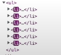
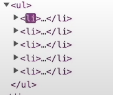

# List Key

- 리스트 내부의 안정적이고 고유한 값이여야 한다 
  - index는 안정적이지 않음 


## list key를 사용해야 하는이유

```react
//map을 이용한 list내부 요소 보여주기
{
  list.map((item)=>{
    return <li>{item}</li>
  })
}
```

- 만약 다음과 같은 list에서 state를 활용하여 input을 받고 list요소를 추가해 준다면
- react dom에서는 <li>태그를 업데이트 하게될 것이다
- 하지만 어떠한 <li>태그가 업데이트 되었는지를 알지 못하여 모든 <li>태그를 업데이트 해준다 



- 만약 <li>태그가 매우 많아진다면 업데이트가 일어날 때마다 모든 항목이 업데이트가 되는 것은 비효율적이게 된다 



- key값을 주게 된다면 해당 하는 <li>태그만이 업데이트가 된다 

  

### list key로 index를 줄경우(안정적이지 않은 key)

```react
//index를 key로 준경우
{
  list.map((item, index)=>{
    return <li key={index}>{item}</li>
  })
}
```

- 만약 list가 변경될 일이 없는 정적인 list라면 index를 주더라도 상관이 없다 

- 하지만 동적인 list인 경우에는 list 추가에 따른 요소의 index값이 변경 될 수도 있다 

  - 만약 새로운 요소가 list의 앞에 추가가 된다면 새롭게 추가된 요소가 index값이 0이 되므로 기존 요소의 index값이 밀리게 된다
  - 즉, list가 업데이트 될 때마다 key값이 변경이 되므로 react dom이 모든<li>태그를 업데이트 하게 된다 

  

### list key로 item을 줄 경우(고유한 값이 아닌경우)

```react
//item을 key로 준경우
{
  list.map((item)=>{
    return <li key={item}>{item}</li>
  })
}
```

- 중복되는 key값을 넣게 되면 값이 복제가 되거나 올바른 위치에 값이 추가되지 않을 수 있음 

