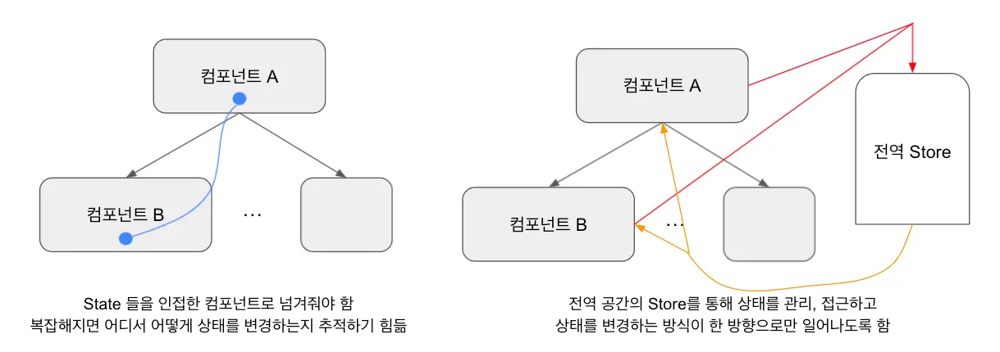
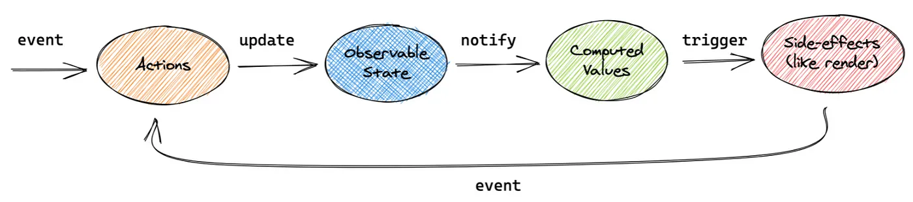

# Mobx

- react에서 사용하는 글로벌 상태관리 툴


 

- react의 state들은 부모 component에서 자식 component로만 전달할 수 있기 때문에 프로젝트가 복잡해질수록 state들을 추적하기 어려워 진다
- mobx는 state를 전역 공간인 store를 만들어 관리 접근 하도록 하였다 


## 작동 원리 



- Action이 실행되면(예시 : onClick, onChange 등), 관찰할 수 있는 state값이 업데이트 된다.
- 이 값을 바라보고 있는 observer에게 notify(알람)을 주고, 그에 따라 랜더링이 trigger 된다.

```typescript
import { action, observable } from "mobx";
import { autobind } from "core-decorators";

@autobind	// typescript 이기 때문에 '@' 사용 가능
class CountStore {		// 전역 state를 관리하는 store를 생성
  @observable count: number = 0;	// action을 관찰하는 state값이 된다

  @action					
  handleCount = (change: number) => {
    this.count = change;		// action이 일어나면 변화값을 state에 넣어준다, observable이 action을 보고있도록 해줌
  };
}

export default CountStore;
```

store가 있는 위치에 index.ts 파일을 생성 해준다 

```typescript
import CountStore from "./CountStore";

const stores = {
  CountStore: new CountStore()
};

export default stores;		
```

src/index.tsx 파일 수정

```typescript
import React from "react";
import { Provider } from "mobx-react";
import ReactDOM from "react-dom";
import App from "./App";
import * as serviceWorker from "./serviceWorker";
import stores from "./stores";

ReactDOM.render(
  <Provider store={stores}>		// 전역적으로 state를 사용할 수 있도록 공급해준다 
    <React.StrictMode>
      <App />
    </React.StrictMode>
  </Provider>,
  document.getElementById("root")
);

// If you want your app to work offline and load faster, you can change
// unregister() to register() below. Note this comes with some pitfalls.
// Learn more about service workers: https://bit.ly/CRA-PWA
serviceWorker.unregister();
```

store에 있는 state 가져오기

```typescript
import { inject, observer } from "mobx-react";
import React from "react";
import CountStore from "./stores/CountStore";

interface CountProps {
  store?: StoreType;
}

interface StoreType {
  CountStore: CountStore;
}

const Count = inject("store")(     // inject는 컴포넌트에 props를 주입해준다 
  observer(({ store }: CountProps) => { //observer는 store안에 observable값이 변경되면 자동으로 다시 랜더링 한다 
    const { count, handleCount } = store!.CountStore; //store가 있다고 가정(!.)하고 CountStore에 접근

    return <div>{count}</div>	// 현재 count값을 표시. 이벤트 함수와 handleCount를 사용하여 count를 변경시 자동 랜더링
  })
);

export default Count;
```

