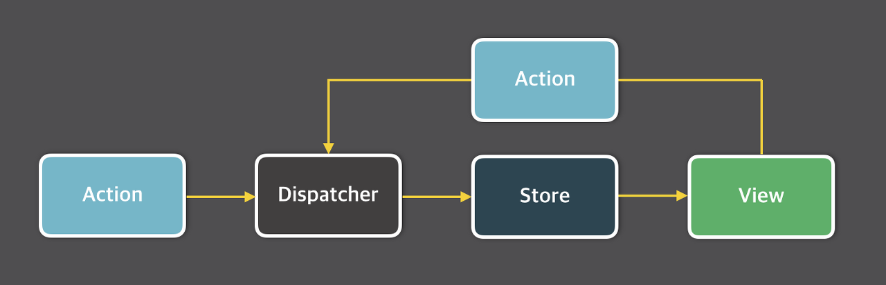
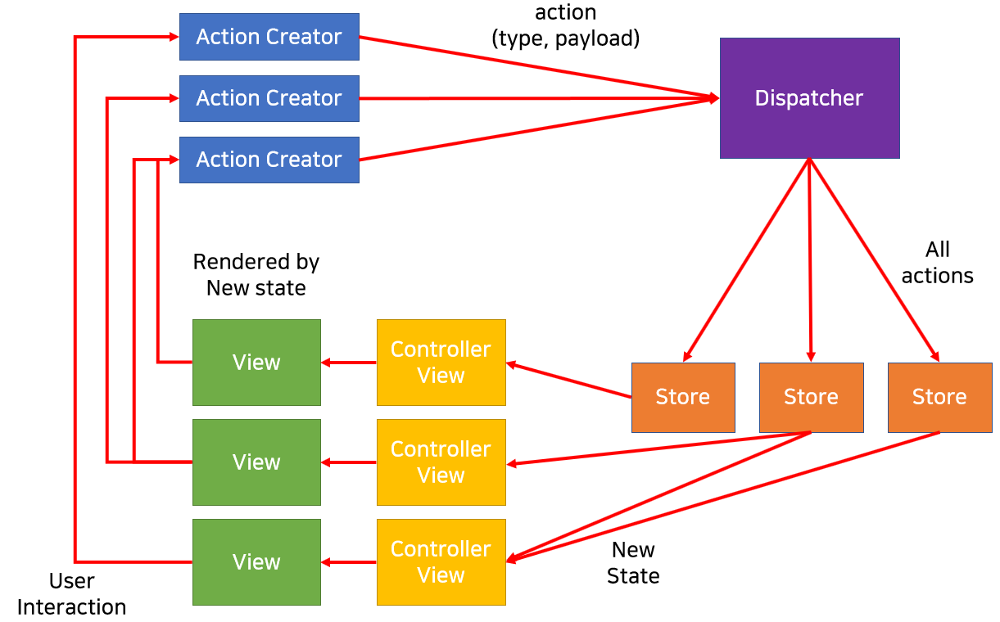
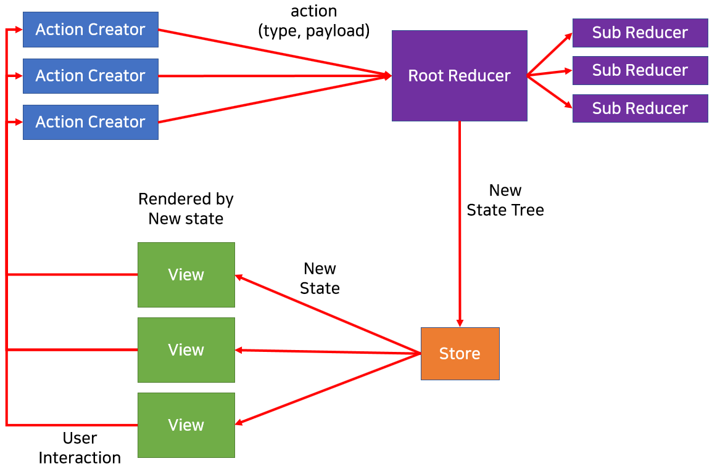
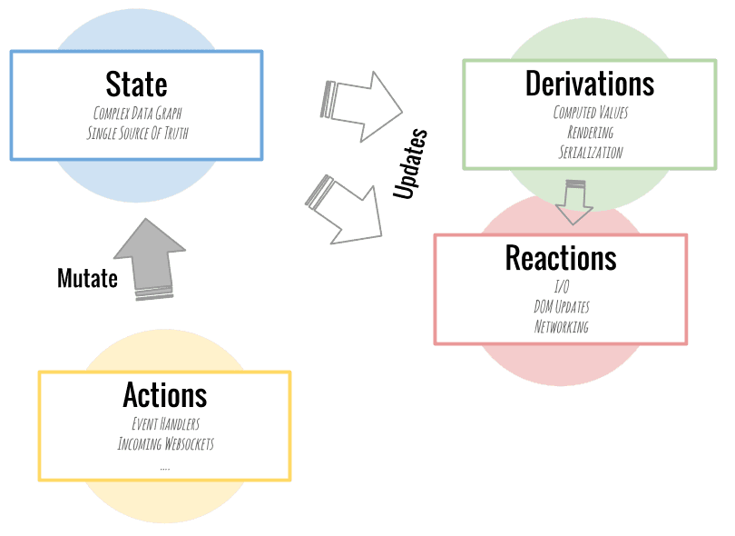

# 상태 관리 라이브러리 비교


- 기존 react는 state를  props로 전달하며 부모 컴포넌트에서 자식 컴포넌트로만 props를 보내는 단방향 바인딩임
- 단 방향으로 state를 관리한다면 프로젝트 규모가 커질 수록 props drilling이 발생하게 된다 
  - props drilling : 자식컴포넌트의 자식컴포넌트의 자식컴포넌트... 과 같은 컴포넌트에게 계속 props의 값을 전달하다보면 props의 depth가 증가하게 된다고 하며 불필요한 리랜더링이 발생하고 디버깅에 추적이 어려워 질 수 있다


## Redux

- 가장 사용량이 많은 상태관리 라이브러리이다

- 데이터의 흐름이 단방향으로 흐르는 Flux 아키텍처 구조다

  - Flux 아키텍처

    

    - 양방향 데이터 흐름은 프로젝트가 커질수록 복잡성이 생기기 때문에 단방향 데이터 흐름으로 만들어낸 아키텍처이다 

    - 액션 생성자 

      - 기존 상태를 변경하기 위한 액션을 생성하여 디스패쳐에 넘겨준다
        - 액션 : 어떤 행위인지와 그 행위로부터 넘겨받은 값들을 가진 하나의 객체 

    - 디스패쳐

      - 모든 액션을 받아 의존성을 처리해준 다음 모든 액션을 모든 스토어에게 넘긴다

    - 스토어 

      - 모든 액션을 받아 자신에게 적합한 액션을 필터링한다. 
      - 이후 상태값을 변경하고 자신에게 연결된 컨트롤러 뷰에게 상태가 변화되었음을 알린다.

    - 컨트롤러 뷰, 뷰

      - 컨트롤러 뷰 : 뷰와 스토어를 연결하는 매개체
      - 뷰 : 컨트롤러 뷰에게 변화된 상태를 받고 그 상태에 따라 다시 렌더링 된다 

      

- 보일러플레이트 코드로 구성되어 있어 유지보수가 쉽고 확장 및 디버깅에 장점이 있다

  - 보일러 플레이트 코드 
    - 별 수정없이 반복적으로 사용되는 코드
    - 코드를 복사하여 필요 부분만 수정하여 사용하는 코드 

- 많은 양의 보일러프레이트 코드를 사용하여 복잡해진다 

  

### 구조

- 액션 생성자

  - 액션 생성자는 사용자가 요청한 액션을 만들어서 포맷에 맞게 돌려준다 

- 스토어

  - Flux에선 다수의 스토어를 가질 수 있지만 Redux는 단 하나의 스토어를 가진다.
  - 상태트리 라고 불리는 상태값을 유지한다 

- 리듀서

  - 디스패처가 없는 대신 리듀서가 상태변화로직을 담당

  - 전체 리듀서를 관리하는 루트 리듀서와 하위의 서브 리듀서로 나뉜다 

  - 루트 리듀서는 상태 객체의 키를 기준으로 나누어 서브 리듀서에게 보낸다 

  - 서브 리듀서는 이전 상태를 변경하지 않고 복사해서 변경한다 

    - 이것이 키 아이디어 이며 이렇게 상태 객체를 업데이트 시키고 루트 리듀서에게 돌려준다 

  - 루트 리듀서는 서브 리듀서들로 받은 상태 객체들을 취합해서 스토어로 보낸다 

    


## MobX

- redux에 비해 간결하고 깔끔한 구조를 가지고 있다 

- 모든 상태 변화가 일어나는 부분을 자동으로 추적해준다

- redux와 다르게 store에 제한이 없다 

- state의 불변성을 위해 노력하지 않아도 된다

  - 불변성 
    -  react의 state는 state값을 유지시키고 그것을 복사해서 업데이트한 값으로 바꾸어  준다
    - shouldComponentUpdate를 실행해서 true를 리턴하면 re-render 하게된다 
      - 각각의 컴포넌트는 shouldComponentUpdate라는 메소드를 가지고 있으며 이것은 setState를 호출(state의 변경)하면 실행되고 반환값(boolean)에 따라 re-render를 할지에 대한 여부를 결정한다  
      - 이 때 호출된 변경된 값인 setState의 값과 기존값이 state의 값을 비교하여 변경사항을 파악할 수 있게된다 
    - state의 불변성이 지켜졌기 때문에 변경값 setState와의 비교를 하여 변경여부를 알 수 있고 re-render를 실행할 수 있게된다 
  - MobX는 @observable로 변경여부를 판단

- 양방향 데이터 바인딩 패턴을 사용한다 

  

### 구조



- state
  - observable state로 관찰 받고 있는 데이터
  - 변화가 일어나면 reactions와 deivations를 발생시킴
- derivations 
  - 기존의 상태가 변화에 따라 계산된 값을 의미
- reactions
  - 값이 바뀜에 따라 해야할 일을 정하는 것
  - I/O와 관련된 작업을 하고, DOM업데이트와 네트워크 요청 등에 관여 
- action 
  - 상태를 변경시키는 모든 것을 의미 
  - 모든 사용자의 액션으로 발생하는 상태 변화들이 전부 derivations와 reactions로 처리되도록 한다 


## Jotai

- atomic model 기반의 상향식 접근 방법에 영감을 받아 만들어졌다 

- 아톰과 함께 상태를 생성하고 아톰 의존성에 따라 렌더링 최적화를 하는데, 이 방식을 통해 리액트 컨텍스트의 리렌더링 이슈를 해결

  - 리액트 컨텍스트 

    - 컴포넌트에세 props를 사용하지 않고 필요한 데이터를 넘겨주며 사용할 수 있게 해줌 

      ```typescript
      import React from 'react';
      export const UserContext = React.createContext();
      export default function App() {
        return (
          <UserContext.Provider value="Reed">
            <User />
          </UserContext.Provider>
        )
      }
      function User() {
        const value = React.useContext(UserContext);  
          
        return <h1>{value}</h1>;
      }
      ```

    - context provider가 객체를 내려주고 있는 형태이며 객체가 업데이트 된다면 해당 context를 사용하는 모든 컴포넌트에서 재렌터링이 일어나게 된다 

  - 간단한 상태관리에 적합하다 

  - Context Api의 간편한 사용법을 이용하여 상태 관리를 할 수 있다 

  - 총 번들 사이즈가 다른 라이브러리에 비해 낮은 편이다 

### 구조

- atom 
  - 아톰이라는 상태를 생성하며 초깃값을 넣어준다
  - 아톰 자체는 업데이트가 되더라도 리렌더링을 일으키지 않는다 
- useAtom
  - 아톰을 넣어주고 그 아톰을 사용하여 읽고 변경을 할 수 있도록 해준다
  - 상태의 변경을 감지하여 랜더링을 해준다
  - useAtom을 이용하면 상태를 변경한다는 전제하에 사용되기 때문에 컴포넌트가 랜더링이 될때 상태값(count)을 사용을 하였지만 변경(setCount)을 하지않아도 상태값을 다시 계산하는 리렌더링이 발생하게 된다  
- useAtomValue
  - 아톰이라는 상태의 현재값을 사용할 수 있다
  - 상태가 변경된다면 리렌터링 하여 최신 상태를 가져온다
    - 직접 atom을 가져와서 상태값을 출력할 수 있지만 useAtomValue를 이용한다면 상태값이 변경될 때만 컴포넌트가 리렌더링하여 불필요한 리렌더링이 일어나지 않게 할 수 있다 
- useSetAtom
  - 아톰이라는 상태값을 변경할때 사용한다
  - 해당 훅을 호출해도 리랜더링은 일어나지 않는다 

